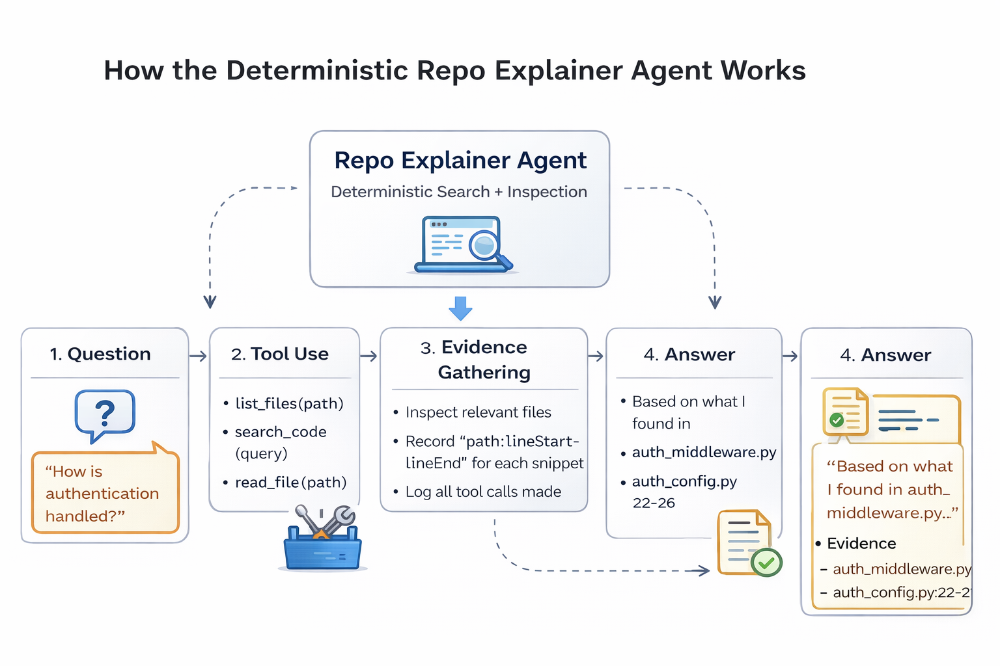
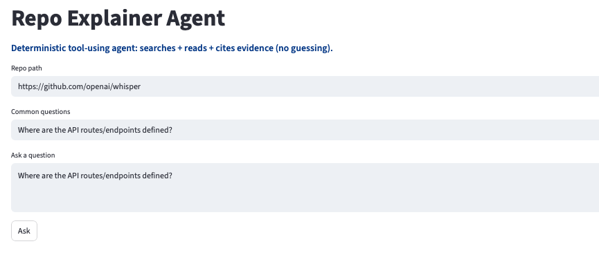
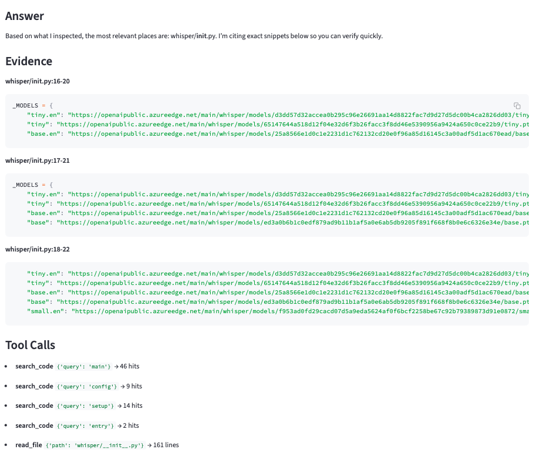

Project 1 — Agentic AI Evolution Series: Repo Explainer Agent
=====================

Overview
-----------
Repo Explainer Agent is a deterministic tool-using agent designed to inspect, search, and explain a public code repository, using a strictly deterministic approach.
This project is intentionally built without autonomous reasoning or hidden context.
It serves as the foundational baseline for an AgenticAI larger journey: moving from simple agents architecture to more sophisticated architectures.

What This Agent Does
--------------
Unlike typical LLM-powered code assistants, this agent:

	•	Reads repositories only through explicit tools
	•	Cites exact file paths and line ranges as evidence
	•	Refuses to answer when evidence is insufficient
	•	Exposes every tool call it makes

The Repo Explainer Agent can answer questions such as:

	•	Where is configuration loaded and managed?
	•	How do I run this project locally?
	•	Which file controls logging?
	•	Where is authentication handled?

Every answer is backed by verifiable evidence.

Project layout
--------------
	•	`src/agent/`: core agent modules (orchestrator, policies, tools, evidence, models)
	•	`src/cli.py`: simple CLI entry to invoke the agent
	•	`tests/`: space for tests
	•	`docs/`: specifications, architecture, examples
	•	`sample_repo/`: optional tiny demo repo to test against
	•	`pyproject.toml`: project metadata

Web UI
-----
The project includes a simple web interface that allows you to:
	•	Point the agent at any public repository
	•	Ask most common questions questions
	•	Observe tool calls in real time
	•	Review cited evidence side-by-side with answers

This UI is meant for learning and transparency, not abstraction.

License
-----
MIT

Use Case
-----

